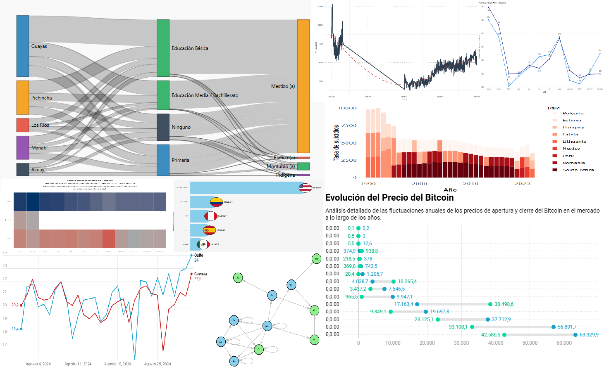

# 30DayChartChallenge
The #30DayChartChallenge is an annual data visualization challenge where participants create and share a chart every day for 30 days, usually during April. Each day has a specific theme or prompt, encouraging creativity and skill development in data visualization. In 2024 I participed in the challengue and created the visualizations using  Quarto, Datawrapper and Power BI.

